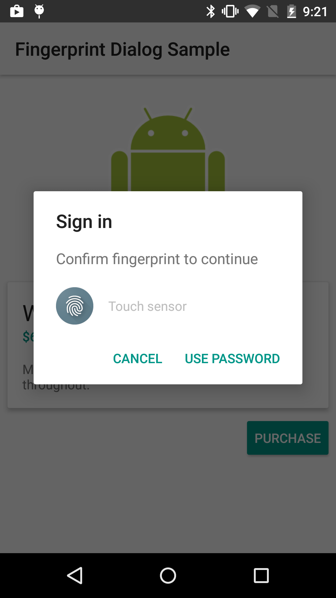
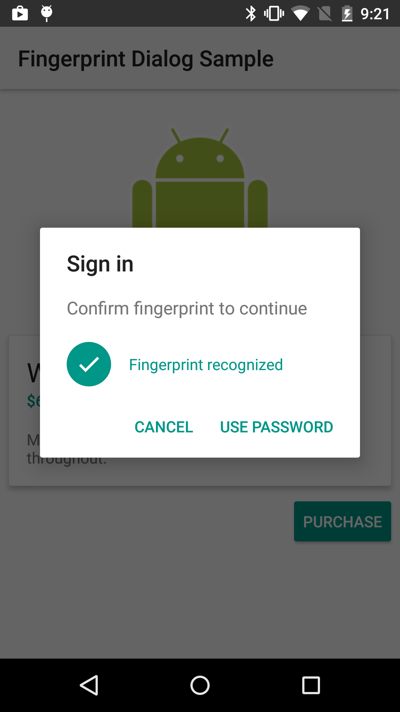

Android Fingerprint Dialog Sample Sample
===================================

A sample that demonstrates to use registered fingerprints to authenticate the user in your app

Introduction
------------

This sample demonstrates how you can use registered fingerprints in your app to authenticate the user
before proceeding some actions such as purchasing an item.

First you need to create a symmetric key in the Android Key Store using [KeyGenerator][1]
which can be only be used after the user has authenticated with fingerprint and pass
a [KeyGeneratorSpec][2].

By setting [KeyGeneratorSpec.Builder.setUserAuthenticationRequired][3] to true, you can permit the
use of the key only after the user authenticate it including when authenticated with the user's
fingerprint.

Then start listening to a fingerprint on the fingerprint sensor by calling
[FingerprintManager.authenticate][4] with a [Cipher][5] initialized with the symmetric key created.
Or alternatively you can fall back to server-side verified password as an authenticator.

Once the fingerprint (or password) is verified, the
[FingerprintManager.AuthenticationCallback#onAuthenticationSucceeded()][6] callback is called.

[1]: https://developer.android.com/reference/javax/crypto/KeyGenerator.html
[2]: https://developer.android.com/reference/android/security/KeyGenParameterSpec.html
[3]: https://developer.android.com/reference/android/security/KeyGenParameterSpec.Builder#setUserAuthenticationRequired().html
[4]: https://developer.android.com/reference/android/hardware/FingerprintManager#authenticate().html
[5]: https://developer.android.com/reference/javax/crypto/Cipher.html
[6]: https://developer.android.com/reference/android/hardware/FingerprintManager.AuthenticationCallback#onAuthenticationSucceeded().html

Pre-requisites
--------------

- Android SDK v23
- Android Build Tools v23.0.0
- Android Support Repository

Screenshots
-------------

    

Getting Started
---------------

This sample uses the Gradle build system. To build this project, use the
"gradlew build" command or use "Import Project" in Android Studio.

Support
-------

- Google+ Community: https://plus.google.com/communities/105153134372062985968
- Stack Overflow: http://stackoverflow.com/questions/tagged/android

If you've found an error in this sample, please file an issue:
https://github.com/googlesamples/android-Fingerprint Dialog Sample

Patches are encouraged, and may be submitted by forking this project and
submitting a pull request through GitHub. Please see CONTRIBUTING.md for more details.

License
-------

Copyright 2014 The Android Open Source Project, Inc.

Licensed to the Apache Software Foundation (ASF) under one or more contributor
license agreements.  See the NOTICE file distributed with this work for
additional information regarding copyright ownership.  The ASF licenses this
file to you under the Apache License, Version 2.0 (the "License"); you may not
use this file except in compliance with the License.  You may obtain a copy of
the License at

http://www.apache.org/licenses/LICENSE-2.0

Unless required by applicable law or agreed to in writing, software
distributed under the License is distributed on an "AS IS" BASIS, WITHOUT
WARRANTIES OR CONDITIONS OF ANY KIND, either express or implied.  See the
License for the specific language governing permissions and limitations under
the License.
